<div align="center">



<br>

<a href="https://omararafa295-cmd.github.io/Omar-Arafa-Portfolio/index.html">
  
</a>
<a href="https://linkedin.com/in/omar-arafa-641504358/">
  
</a>
<a href="mailto:omararafa294@gmail.com">
  
</a>

</div>

---

## `~/core-logic` — Who Am I?

```php
<?php

namespace App\Engineers;

use Tech\Software\Laravel;
use Tech\Hardware\EmbeddedSystems;

class OmarArafa implements FullStackInterface, ControlSystemsInterface
{
    use ProblemSolving;

    private string $university = 'Zagazig University';
    private string $major = 'Computer & Systems Engineering';
    private int $academicYear = 3;

    public function getSystemStatus(): array
    {
        return [
            'Current Focus' => 'Architecting scalable backend solutions & IoT integration',
            'Architecture'  => ['MVC', 'Service-Oriented', 'RESTful APIs'],
            'Hardware Core' => 'PID Controllers, Sensor Integration, Microcontrollers',
        ];
    }

    public function executeDailyProcess(string $currentTask): string
    {
        return match ($currentTask) {
            'backend'  => Laravel::buildScalableAPI()->optimizeQueries(),
            'hardware' => EmbeddedSystems::tunePID()->deployToArduino(),
            'learning' => $this->absorbNewTechnologies(),
            default    => 'Compiling code and drinking coffee... ☕'
        };
    }
}
```

---

## `~/stack` — Build Environment

<div align="center">


</div>

<br>

<table align="center">
  <tr>
    <td><b>Backend</b></td>
    <td>PHP • Laravel • RESTful APIs • MySQL</td>
  </tr>
  <tr>
    <td><b>Frontend</b></td>
    <td>HTML • CSS • JavaScript • Bootstrap</td>
  </tr>
  <tr>
    <td><b>Architecture</b></td>
    <td>MVC • Service-Oriented Design</td>
  </tr>
  <tr>
    <td><b>Hardware</b></td>
    <td>PID Controllers • Sensor Integration • Microcontrollers • IoT</td>
  </tr>
  <tr>
    <td><b>Toolchain</b></td>
    <td>Git • GitHub • VS Code • Arduino</td>
  </tr>
</table>

---

## `~/status` — Current Focus

```text
[01] Building scalable Laravel backends
[02] Improving database and API architecture
[03] Connecting software systems with embedded hardware
[04] Learning through practical engineering projects
```

---

<div align="center">

### `omar@developer:~$ keep_building_`


<br><br>


</div>
